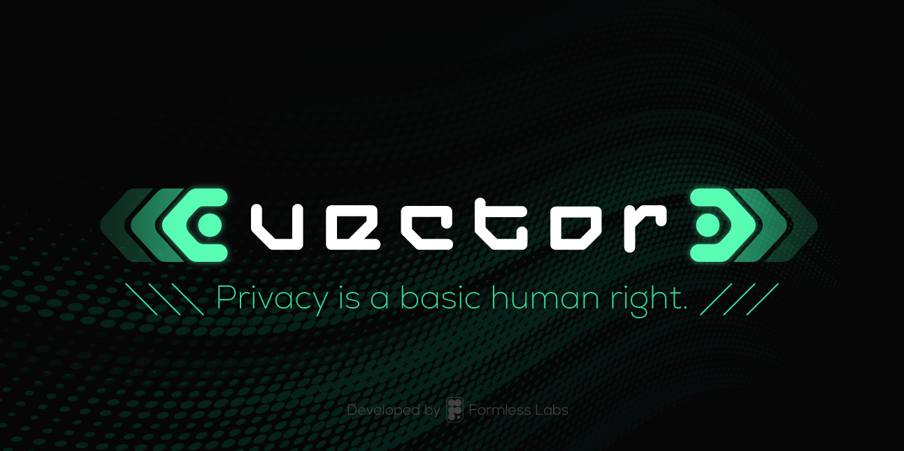

 
---
<h3 align="center">
  Private & Encrypted Messenger App
</h3>

<h4 align="center">
  Designed for everyone, providing a safe and secure “hardline” between you and your contacts.
</h4>

<p align="center">
  <a href="https://github.com/VectorPrivacy/Vector/releases/download/v0.1.8/Vector_0.1.8_x64-setup.exe">Windows</a> | <a href="https://github.com/VectorPrivacy/Vector/releases/download/v0.1.8/Vector_0.1.8_x64.dmg">MacOS</a> | <a href="https://github.com/VectorPrivacy/Vector/releases/download/v0.1.8/Vector_aarch64.app.tar.gz">Linux</a>

---

<p align="center">
  Vector is a decentralized communication platform built on the Nostr Protocol, offering no-compromise encryption with zero metadata leakage and plausible deniability for all content, including texts, media, voice notes, and files,     adhering to the NIP-17 standard.
</p>

---


### Free-to-Use, Open-Source

Vector Privacy is a free messenger application that was designed for anyone around the world that seeks to protect their basic human right to privacy and wants to speak freely, without being monitored by third-parties for any intrusive reason. Vector is also open source, which means that the codebase is public and anyone can review its technical design, verify authenticity, as well as contribute to improve the overall quality for all users.

---


### No Compromise Encryption

Vector utilizes a decentralized relay network (Nostr) as the base infrastructure to communicate information and transmit data, which means it is not stored on a centralized server. The chosen standard, NIP-17, provides a secure and private way for users to communicate directly with each other on the Nostr network. It achieves this by using a combination of [NIP-44 encryption](https://github.com/nostr-protocol/nips/blob/master/44.md), [NIP-59 seals](https://github.com/nostr-protocol/nips/blob/master/59.md), and [gift wraps](https://github.com/nostr-protocol/nips/blob/master/59.md).

---


### No Personal Data Tracing, Breaches, & Leaks

Vector doesn’t store your personal data in a centralized cloud service or on centralized servers, thus massively reducing the risk of data leaks and private information being shared against the will of the rightful owner. By design, Vector does not possess the technical permissions or abilities to access private information of Vector users. Even Vector developers, nor Formless Labs, have access or permission to your information and data.

---

# Purpose

Vector was born out of a feeling of, for the lack of a better word; "necessity".

The messengers with all the cool features, have stark downsides: opt-in proprietary encryption (Telegram), no encryption at all (Discord), or encryption added, almost seemingly through pity, and most certainly with backdoors, to apps created by the world's largest and most anti-human tech conglomerates (Meta's WhatsApp).

The messengers with the most sovereign, decentralised, E2E Encrypted philosophies: lack incredibly basic features, or have such an archaic and illegible User Experience, that the modern user of this century feels as if they've returned to the Stone Age; flooded with a tangled-web of bugs, a slowness familiar only to P2P software, and governance issues.

In addition to security and privacy in communication, modern software has hit a brick wall: you now need half a gig of RAM to open a simple messaging app, and the React framework plagues the entire web.

Modern software wastes Modern compute, because developers have gotten lazy, and project managers have gotten greedy.

**Vector; possibly naively, but surely bravely, aims to fill this gap.**

Powered by Passion, Built on [Nostr](https://nostr.com/).

---

# Compiling

> [!NOTE]
> For any additional help or questions, visit the [Vector Community Discord](https://discord.gg/ar2pnE9Huy).

### Build Guides

| Platform | Guide |
|----------|-------|
| Ubuntu / Debian | [docs/build/ubuntu.md](docs/build/ubuntu.md) |
| macOS → Android | [docs/build/macos-android.md](docs/build/macos-android.md) |
| Your OS missing? | [Contribute a guide!](docs/build/) |

---

# Bare Builds

Vector supports "bare builds" - a minimal compilation mode that excludes optional features for enhanced security and performance, while not the recommended experience for most users, Vector bare builds are hardened, faster, and lighter; at the expense of more "glamorous" and complex features.

### Why Use Bare Builds?

- **Reduced Attack Surface**: Fewer dependencies & less code means fewer potential vulnerabilities.
- **Resource Efficiency**: Lower memory and CPU usage, with faster boot time.
- **True Minimalism**: A powerful app, with only the core necessities.

### Building Vector Bare

```bash
# Development bare build
npm run dev:bare

# Production bare build
npm run build:bare
```

### What's Excluded?

Currently, bare builds exclude:
- Vector Voice AI (Whisper and its GPU ML dependencies, like Vulkan).

### Standard vs Bare

- **Standard Build**: Full suite of features, maximum utility and range of function.
- **Bare Build**: Core functionality only, maximum security and efficiency.

The bare build is perfect for users who prioritize security, privacy, and performance over additional features like Local AI and flashy utility features.

---

## Attributions

Vector uses third-party assets and resources. For a complete list of attributions and licenses, please see our [Attributions](docs/attributions.md) document.

---

> [!WARNING]
> Privacy is a basic human right.