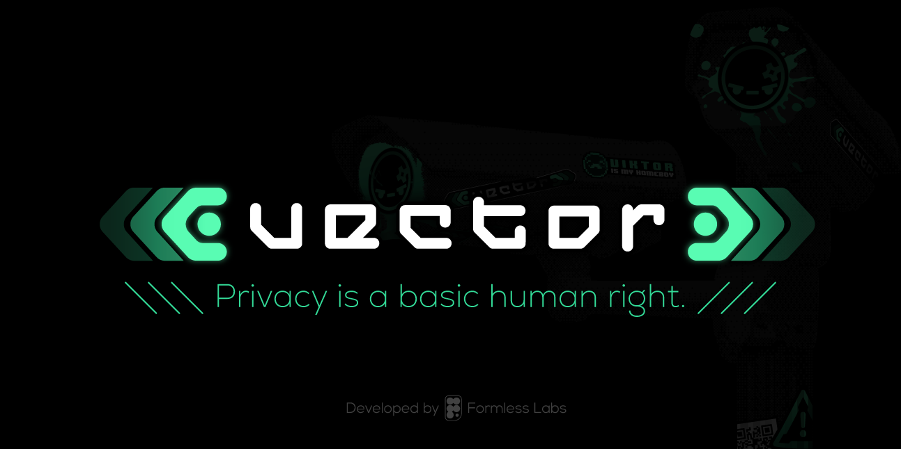
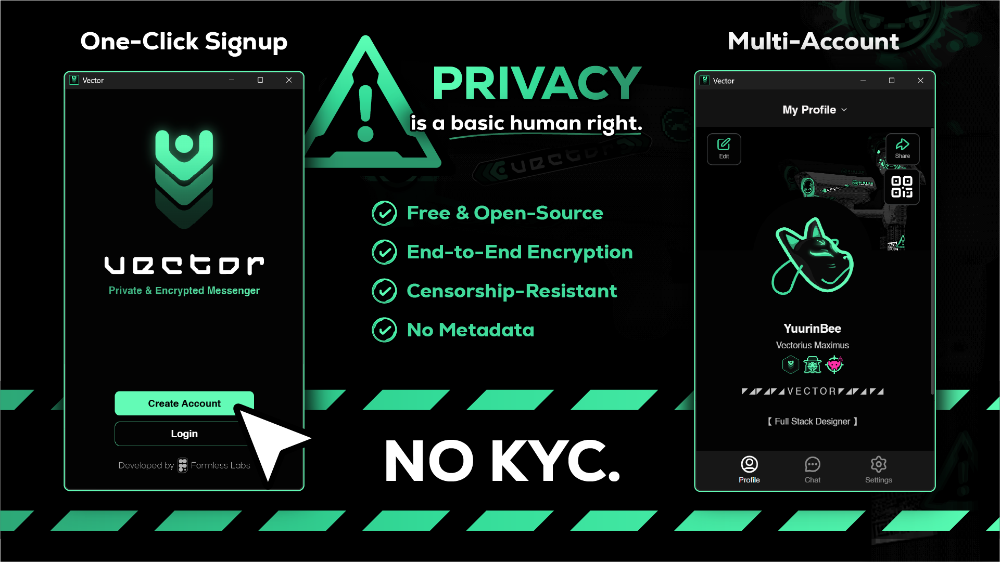
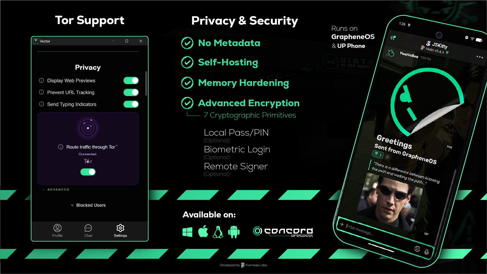
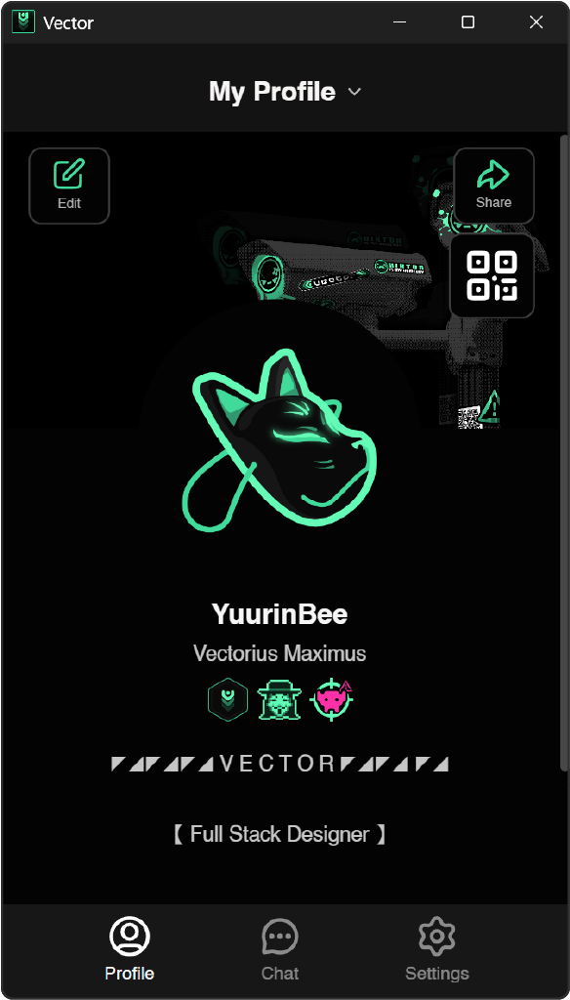
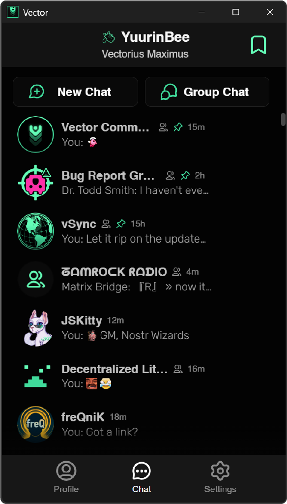
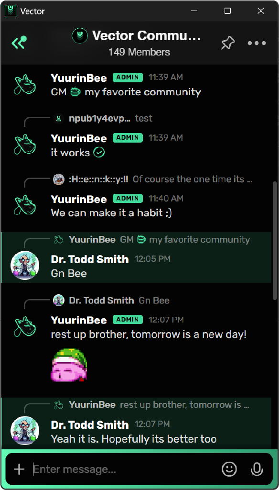

<p align="center">
  <a href="https://github.com/VectorPrivacy/Vector/releases/latest"></a>
  <a href="https://github.com/VectorPrivacy/Vector/releases/latest"></a>
  <a href="https://github.com/VectorPrivacy/Vector/releases/latest"></a>
  <a href="https://github.com/VectorPrivacy/Vector/releases/latest"></a>
  <a href="https://github.com/VectorPrivacy/Vector/releases/latest"></a>
  <a href="https://github.com/VectorPrivacy/Vector/blob/master/LICENSE"></a>
</p>

---

<h3 align="center">
  Private & Encrypted Messenger App
</h3>

<h4 align="center">
  Designed for everyone, providing a secure and private “hardline” between you and your contacts.
</h4>

---

<p align="center">
  
  
</p>

---

<p align="justify">
  Vector is a free, open-source messenger built for private communication without compromise. There's no phone number, no email, and no account to create, just download it and start talking. Your messages, files, and communities are end-to-end encrypted, and no company or server sits in the middle able to read them, sell your data, or shut you down. Vector is designed to be light and efficient, running on under 200MB of RAM, so it works well on virtually any device, including older phones and low-powered hardware. No ads. No tracking. No exceptions.
</p>

---


### Free-to-Use, Open-Source

Vector Privacy is a free messenger application that was designed for anyone around the world that seeks to protect their basic human right to privacy and wants to speak freely, without being monitored by third-parties for any intrusive reason. Vector is also open source, which means that the codebase is public and anyone can review its technical design, verify authenticity, as well as contribute to improve the overall quality for all users.

---


### No Compromise Encryption

Vector runs on [Nostr](https://nostr.com/), a decentralized relay network, so your data is never stored on a centralized server that can read it, sell it, or shut it down. Direct messages use [NIP-17](https://github.com/nostr-protocol/nips/blob/master/17.md), pairing [NIP-44 encryption](https://github.com/nostr-protocol/nips/blob/master/44.md) with [NIP-59 gift wraps](https://github.com/nostr-protocol/nips/blob/master/59.md) to protect both content and metadata. Communities run on [Concord](https://github.com/concord-protocol/concord), a protocol built for encrypted group spaces where authority is a signed roster every member verifies. Learn more about [Vector's Encryption](https://vector-privacy.gitbook.io/vector-privacy/vector-messenger/intro/encryption).

---


### No Personal Data Tracing, Breaches, & Leaks

Vector doesn’t store your personal data in a centralized cloud service or on centralized servers, thus massively reducing the risk of data leaks and private information being shared against the will of the rightful owner. By design, Vector does not possess the technical permissions or abilities to access private information of Vector users. Even Vector developers, nor Formless Labs, have access or permission to your information and data.

---

# Purpose

Vector was born out of a feeling of, for the lack of a better word; "necessity".

The messengers with all the cool features, have stark downsides: opt-in proprietary encryption (Telegram), no encryption at all (Discord), or encryption added, almost seemingly through pity, and most certainly with backdoors, to apps created by the world's largest and most anti-human tech conglomerates.

The messengers with the most sovereign, decentralised, E2E Encrypted philosophies: lack incredibly basic features, or have such an archaic and illegible User Experience, that the modern user of this century feels as if they've returned to the Stone Age; flooded with a tangled-web of bugs, a slowness familiar only to P2P software, and governance issues.

In addition to security and privacy in communication, modern software has hit a brick wall: you now need half a gig of RAM to open a simple messaging app, and the React framework plagues the entire web.

Modern software wastes Modern compute, because developers have gotten lazy, and project managers have gotten greedy.

**Vector; possibly naively, but surely bravely, aims to fill this gap.**

Powered by Passion, Built on [Nostr](https://nostr.com/).

---

# Features

### 🔐 Privacy & Security
- **No Phone Number, No Email, No KYC:** Sign up with nothing but a keypair. No identity to leak, subpoena, or sell.
- **Built-In Tor:** Route all traffic through an embedded Tor client in one click, bridges included for censorship circumvention.
- **Remote Signers:** Keep your keys in a separate signer via NIP-46, or Amber on Android. Your nsec never touches the app.
- **Metadata Stripped by Default:** EXIF and location data removed from every photo before it leaves your device.
- **Self-Destructing Messages:** Set a per-chat timer and watch messages disappear on your own schedule.
- **Local Encryption:** Protect your account with a PIN, password, or biometrics.

### 👥 Communities & Chat
- **Encrypted Communities:** Discord-style spaces with channels, roles, and admins, fully end-to-end encrypted.
- **Bans That Actually Work:** Removing a member re-keys the room, cryptographically locking them out of everything that follows.
- **Rich Message Composer:** Markdown, mentions, and custom emojis render live as you type.
- **Voice Messages:** Record and send audio, with optional on-device AI transcription.
- **Multiple Accounts:** Run several identities on one install with an in-app switcher.

### 🎨 Style & Customization
- **Custom Emoji Packs:** Create, crop, and share your own packs, compatible with other Nostr clients.
- **Chat Wallpapers:** Set a custom background per conversation with live blur and brightness controls.
- **Themes:** 7 built-in themes, including XMR and Satoshi.

### 🛠️ For Developers
- **Vector SDK:** Build bots in about a dozen lines of Rust, no protocol knowledge required.
- **Slash Commands:** Ship real commands with typed parameters through a Discord-style picker.
- **Mini Apps:** Run interactive multiplayer apps and games directly inside encrypted chats.
- **AI Agent Support:** An MCP server gives AI agents 21 tools to drive Vector programmatically.

---

# Screenshots
<p align="center">
  
  
  
</p>

---

# Install

Download the latest release for your platform. No account, no phone number, no email required.

| Platform | Download |
|----------|----------|
| Windows | [Latest Release](https://github.com/VectorPrivacy/Vector/releases/latest) |
| macOS | [Latest Release](https://github.com/VectorPrivacy/Vector/releases/latest) |
| Linux | [Latest Release](https://github.com/VectorPrivacy/Vector/releases/latest) |
| Android | [Latest Release](https://github.com/VectorPrivacy/Vector/releases/latest) |

> [!NOTE]
> The Android build is a standard APK and runs on de-Googled and privacy-focused Android variants, including [GrapheneOS](https://grapheneos.org) and UP Phone.

Prefer to build from source? See [Compiling](#compiling) below.

---

# Compiling

> [!NOTE]
> For any additional help or questions, visit the official [GitBook](https://docs.vectorapp.io) or join the [Vector Community on Vector](https://chat.vectorapp.io) or [Vector Community Discord](https://discord.gg/ar2pnE9Huy).

### Build Guides

| Platform | Guide |
|----------|-------|
| Ubuntu / Debian | [docs/build/ubuntu.md](docs/build/ubuntu.md) |
| macOS → Android | [docs/build/macos-android.md](docs/build/macos-android.md) |
| Your OS missing? | [Contribute a guide!](docs/build/) |

---

# Bare Builds

Vector supports "bare builds," a minimal compilation mode that excludes optional features for enhanced security and performance. While not the recommended experience for most users, bare builds are hardened, faster, and lighter, at the expense of more complex and "glamorous" features.

### Why Use Bare Builds?

- **Reduced Attack Surface**: Fewer dependencies & less code means fewer potential vulnerabilities.
- **Resource Efficiency**: Lower memory and CPU usage, with faster boot time.
- **True Minimalism**: A powerful app, with only the core necessities.

### Building Vector Bare

```bash
# Development bare build
npm run dev:bare

# Production bare build
npm run build:bare
```

### What's Excluded?

Currently, bare builds exclude:
- Vector Voice AI (Whisper and its GPU ML dependencies, like Vulkan).

### Standard vs Bare

- **Standard Build**: Full suite of features, maximum utility and range of function.
- **Bare Build**: Core functionality only, maximum security and efficiency.

The bare build is perfect for users who prioritize security, privacy, and performance over additional features like Local AI and flashy utility features.

---

# Resources

Explore the official Vector website, documentation, and developer resources below.

- [Website](https://vectorapp.io)
- [GitBook](https://docs.vectorapp.io)
- [Vector SDK](https://vector-privacy.gitbook.io/vector-privacy/vector-sdk)
- [Vector Hub](https://vectorapp.io/hub)
- [Privacy Policy](https://vectorapp.io/privacy-policy)

## Socials

Follow the channels below for the latest on development, releases, and community updates.

- [Vector Blog](https://vectorapp.io/blog)
- [X/Twitter](https://x.com/vectorprivacy)
- [Vector Community](https://chat.vectorapp.io)
- [Discord](https://discord.gg/ar2pnE9Huy)

<sub>⚠️ Always verify the authenticity of links before clicking.</sub>

---

# Donate

Vector is free, open-source, and funded entirely by donations. No ads, no tokens, no venture capital.

| Currency | Address |
|----------|---------|
| Monero (XMR) | `47ENi8rwDxqNYNoCnGhGGGLaE2YbA6B9DVXgUbiewyM1F6G4fFGGGK31Am9RqTz2WddDKoeNwaZSufR9seT7knQ44UPjHF8` |
| Bitcoin (BTC) | `bc1q70zhkfuej2cl9nhrxwqcnvrzpwm9kqtrth3tmc` |
| Ethereum (ETH) | `0x20CF19c23fC747C6E88Fee9Adb2d7F5C0Dc59892` |

<sub>*The ETH wallet supports all EVM-compatible chains and tokens.*</sub>

If you're interested in donating in a way that isn't listed above, see our [Donations page](https://vector-privacy.gitbook.io/vector-privacy/vector-messenger/more/donations).

<sub>⚠️ Always verify donation addresses against the [official Donations page](https://vector-privacy.gitbook.io/vector-privacy/vector-messenger/more/donations) before sending.</sub>

---

## Attributions

Vector uses third-party assets and resources. For a complete list of attributions and licenses, please see our [Attributions](docs/attributions.md) document.

---
## License

Vector is released under the [MIT License](LICENSE).

You are free to use, copy, modify, merge, publish, distribute, sublicense, and build upon this project for any purpose, commercial or personal, as long as the original license notice is included. This project is provided as-is, without warranty of any kind.

