# Understanding Concord

*The protocol behind Vector's Communities — end-to-end encrypted, Discord-style group chat with no company in the middle.*

> **TL;DR**
> - Concord lets people run **communities and channels** — what Discord calls *"servers"* — but with **no central server**: no company, no computer in the middle that holds your messages or decides who's in charge.
> - Being a **member** just means **holding a key**. Reading a room is having the key to that room. That's it.
> - **Moderation still works** — owners, admins, kicks, bans — but authority is a *signed list everyone can check*, not a power a central server grants.
> - Messages are **end-to-end encrypted**. The relays that pass them around can't read them, and neither can anyone without the room's key.

This guide explains the *ideas* and *how it fits together*, in plain English — the concepts, not the cryptographic fine print.

> A quick naming note: **Concord** is the *protocol* (the rules). **Communities** is the *feature* you actually use in Vector. Think *Signal Protocol* : *Signal app* :: *Concord* : *Communities*.

---

## Concord in one picture

A Concord community is really just three ordinary things working together:

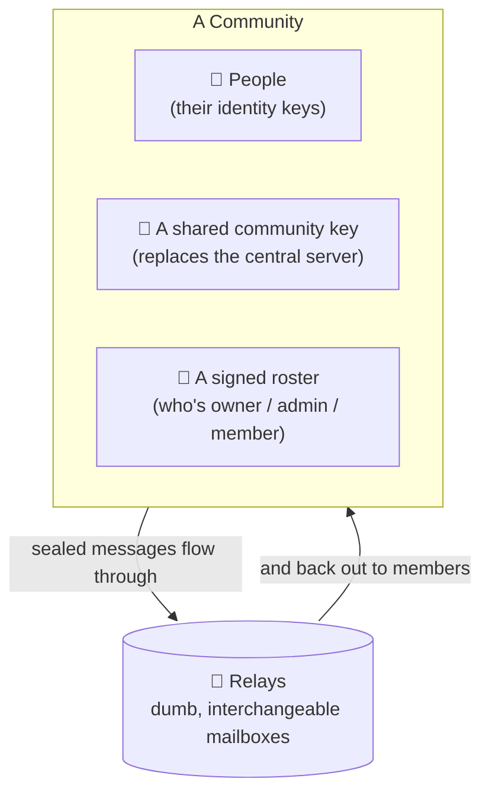

- **People** are just keypairs (the same kind of identity you already have on Nostr).
- **The shared room key** is the secret that defines the community. Hold it, you're in. It does the job a central server's database normally does — except it's a *secret*, not a *machine*.
- **The signed roster** records who the owner and admins are, in a way every member can independently verify.
- **Relays** are simple public mailboxes that store and forward scrambled blobs. They're interchangeable and you use several at once, so no single one is in control or can quietly cut you off.

Everything else in this guide is just *how* those pieces talk to each other safely.

---

## A "server" with no server

> *Wording: a Discord-style "server" we call a **Community**; a **central server** is the company computer in the middle. Concord keeps the first, deletes the second.*

Here's the mental leap. In a normal chat app, there's a central server in the middle. It holds every message, knows every member, and is the final authority on who can do what. You're trusting it — to keep your data private, to stay online, and not to turn on you.

Concord deletes that computer.

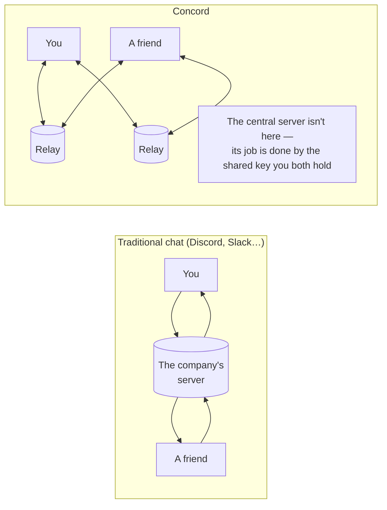

In Concord, the jobs that central server used to do are split into pieces that don't need to trust anybody:

- **Storage and delivery** → handed to **relays**. They only ever see encrypted blobs addressed to rotating, meaningless-looking labels. A relay can't read your community, can't tell who's talking to whom inside it, and if one misbehaves you just use the others.
- **"Who's a member?"** → answered by **key possession**. There's no member list a central server enforces. If you can decrypt the room, you're in it. (Which makes *removing* someone genuinely interesting — that's its own section later.)
- **"Who's in charge?"** → answered by a **signed roster** rooted in the owner's identity. Authority isn't something a central server hands out; it's something everyone can check with math.

The upside: no company to trust, subpoena, hack, or shut down. The cost: the clever parts of Concord are all about doing — *without a referee* — the things a central server normally does for free: agreeing on who's an admin, removing someone for real, and keeping everyone's view in sync. The rest of this guide is how it pulls that off.

---

## The cast of characters

A handful of pieces show up everywhere. Here's the whole cast in one place.

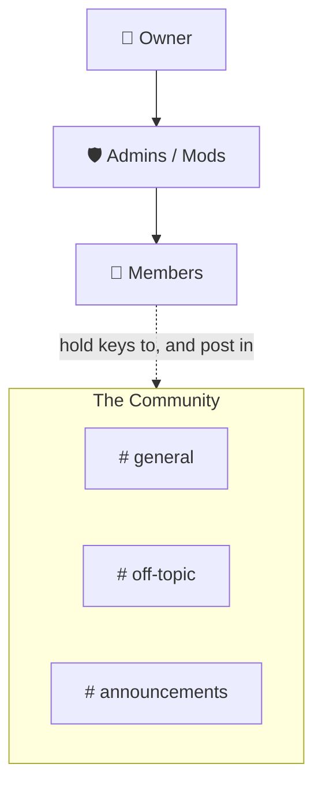

**Identity** — *who you are.* Your personal keypair (your Nostr `npub`). It never leaves your device, and it's how you **sign** everything you do so others can verify it was really you. Same identity you use for DMs.

**Community** — *the "server."* A top-level space with a name, an icon, and a set of channels. Under the hood it's anchored by one master secret (below) and an owner.

**Channel** — *a room.* Like a Discord channel (`#general`). Each channel has **its own key**, so holding the key to one room doesn't automatically unlock another.

**Member** — *anyone holding the keys.* Membership is exactly "I can decrypt this community's rooms." No central list says you belong; the keys in your pocket do.

**Owner** — *the founder, provably.* When a community is created, the founder signs a small certificate (an *owner attestation*) binding the community to their identity. Everyone else **derives** "who's the owner" by checking that signature — nobody can simply *claim* to be owner, because the math wouldn't check out.

**Roles** — *delegated authority.* The owner can grant Admin/Mod-style roles to others. The trick (next section) is that a role isn't a password or a special key — it's an entry in a signed list that says "this person, at this rank." Everyone re-checks that list themselves.

**Relays** — *the mailboxes.* Public Nostr relays that store and forward the encrypted blobs. Concord always uses several at once; they're dumb pipes, fully interchangeable, and never trusted with anything readable.

### The keys, specifically

Concord runs on a few different keys, and it's worth knowing which does what:

| Key | Plain-English job | Think of it as… |
|---|---|---|
| **Your identity key** | Proves *who* said or did something | Your signature / passport |
| **The community key** | The community's master secret; defines membership at its base layer | The key to the building |
| **Channel keys** | Unlock one specific room's messages | A key to one room inside the building |

One more, if you're curious: the throwaway keys

Every message you post is also signed by a brand-new, single-use "envelope" key that's thrown away immediately. This is a privacy detail: it stops the relays from seeing a stable "from" address and linking all your messages together on the outside. Your *real* signature is tucked **inside** the encryption, where only fellow members can see it. More on this in *How a message travels*.

---

## How a message travels

When you send a message in a Community, it gets wrapped in **three layers**, each doing one job. Picture a postcard sealed inside a locked box, dropped off by a courier who refuses to give their name.

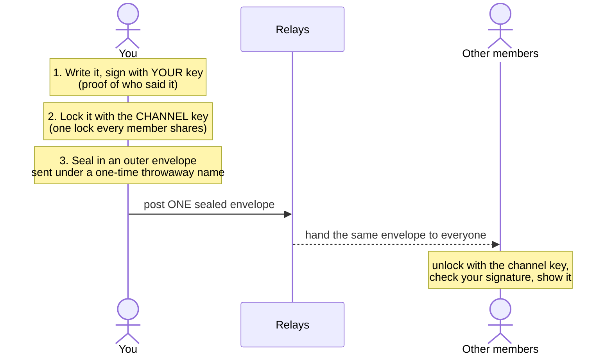

From the inside out:

1. **Your signature (the inside).** The message starts as an event signed by your real identity key — proof it was genuinely you. This signature lives *inside* the encryption, so only fellow members ever see who wrote what. To the outside world it's invisible.

2. **The channel lock (confidentiality).** The whole thing is encrypted with the **channel key** — the single shared secret everyone in that room holds. Anyone without it (including every relay) sees only noise.

3. **The throwaway envelope (unlinkability).** Finally it's wrapped in an outer envelope signed by a **brand-new, single-use key** and addressed to a **rotating, meaningless-looking label** instead of a fixed "#general" address. So a relay can't build a picture of "who keeps posting here" or even "which messages belong to the same room."

### One envelope, many readers

Here's what makes it *scale*. Vector's private DMs seal a separate copy for each recipient — perfect for one-to-one, but a room of 500 people would mean 500 copies of every message.

Concord doesn't do that. Because the channel key is **shared**, there's **one** sealed envelope that **every** member opens with the same key. Post once; the relays just hand out copies of the same blob.

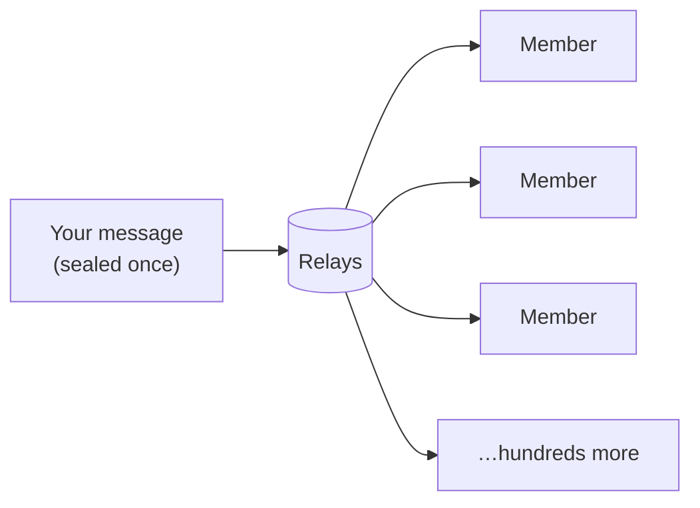

Wait — if everyone shares the key, can a member fake another member's message?

No. The shared *channel* key only locks and unlocks the room; it says nothing about *who* wrote a message. That comes from your personal signature tucked inside, which only your identity key can produce. A member can read everything, but can't forge your name on a message — and can't lift your signed message into a different room either, because each message is cryptographically bound to the exact room it was posted in.

---

## Channels: many rooms, each its own lock

A Community isn't a single chat — it's a set of **channels**, exactly like Discord: `#general`, `#announcements`, `#off-topic`, as many as you like.

But they're more than tabs over one stream. **Each channel is its own sealed room, with its own key.** A message in `#general` is locked with `#general`'s key; `#off-topic` has a different one entirely. The rooms share the same building and the same roster, but each room's conversations are cryptographically separate.

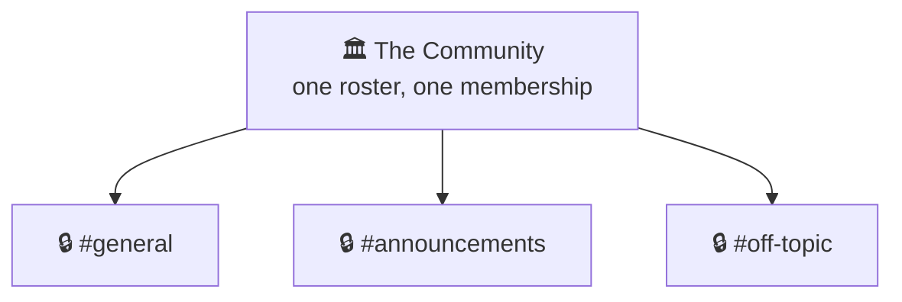

In Concord, a community's membership is *one* membership: hold the invite and you hold the key to every room in it. And because each room already carries its **own** lock, the design leaves the door open to richer setups — members-only channels, say — built on exactly those separate keys.

---

## Who's allowed to do what

If there's no central server, who's the moderator — and what stops anyone from just *declaring* themselves one?

The answer is the **roster**: a list of who holds which role (Owner, Admin, Mod…), rooted in the community's owner and signed all the way down. Authority isn't a key you possess or a switch a central server flips — it's **your verifiable place in that list**.

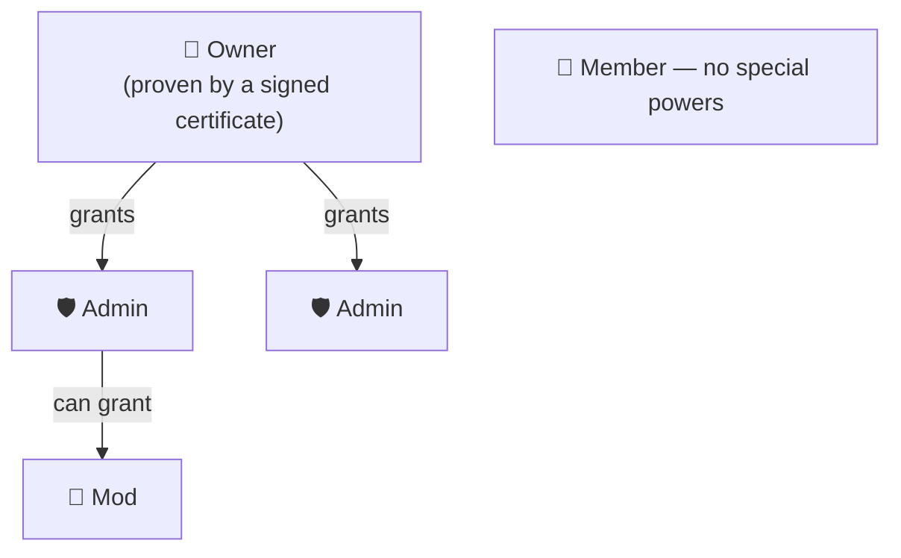

When someone takes a moderator action — hiding a message, renaming the community, banning a member — they **sign it with their own identity** and attach a pointer to the grant that authorizes it. Then the key move:

**Every member's app independently re-checks the math.** It asks: *does this action's signer really hold a role, traceable back to the owner, that permits this — and do they outrank whoever they're acting on?* If yes, honest apps honor it. If no — say a random member forges a "ban" — every app reaches the same verdict and **drops it**. There's no central server to fool and no single app to bribe; the whole community is its own bouncer, and everyone checks the same signatures.

Two rules fall straight out of this:

- **The owner is supreme and unremovable.** Everyone derives who the owner is from that signed certificate, so no one can ban, demote, or impersonate them.
- **You can't act above your rank.** A mod can't ban an admin; an admin can't depose the owner. The signatures simply won't validate as permitted.

> **An honest tradeoff:** this kind of moderation is *cooperative*. Hiding a message asks every well-behaved app to stop showing it — but a hostile, modified app could choose to keep displaying it (the scrambled blob can still linger on relays, the way a "deleted by a moderator" message sometimes does). For *soft* moderation, that's an accepted limit. The *hard* version — actually cutting someone off so they can't read anything new — isn't a polite request; it's **changing the locks**. That's its own fascinating problem, and it's next.

---

## Roles: the full Discord toolkit, verified by everyone

Concord gives you the staff structure you'd expect from a real community platform — **named, colored roles with granular permissions** — and then does something Discord can't: makes every role **verifiable by everyone, with no central server enforcing it.**

Create roles like **Admin**, **Mod**, or whatever you invent — `Veteran`, `Helper`, `Event Host` — each with its own color and its own checklist of what it may do:

- **Manage roles** — grant and revoke roles (up to your own rank)
- **Manage channels** — create, rename, reorganise rooms
- **Edit the community** — name, icon, description
- **Kick** / **Ban** — show someone the door, softly or for good
- **Manage messages** — hide rule-breaking posts
- **Create invites** — mint invitations and links
- …plus **view the audit log**, **mention everyone**, and room to grow

Mix and match them freely. One member can hold several roles at once, and you can make **purely cosmetic roles** too — a colored name tag with no powers, just flair.

**Roles are ranked.** Each sits at a position in the hierarchy, and the rules follow common sense: you can only act on people *below* you, and only grant roles you *outrank*. So a Mod can't ban an Admin, and nobody can quietly promote themselves — the math won't allow it. The Owner sits at the top, unremovable.

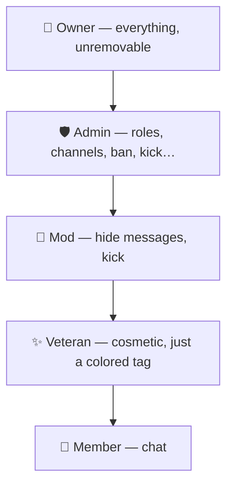

Here's the part that makes it *Concord*: **a role is authority you can prove, not a key you hold.** Promoting someone to Admin doesn't hand over a master password or a shared secret — there's no "admin key" that could ever leak. It simply adds a signed line to the roster — *"this person, at this rank"* — and every member's app re-checks that line for itself. Two happy consequences:

- **Nothing to leak or rotate.** Because admins don't share a secret, an admin going rogue or walking away never forces a key change — you just remove their line.
- **Demotion is instant and clean.** Taking power back is editing one signed record, not a scramble to re-secure a password everyone already knew.

*(Today a permission applies across the whole community — a Mod can moderate every channel. Finer, per-channel roles are a natural next step the design already leaves room for.)*

---

## Getting in: invites

Picture a Community as a private **club**. There are two ways to find your way in:

1. **A mailed invitation** — a *direct invite*. Delivered to your identity as a private, end-to-end-encrypted DM. Only you can open it.
2. **A poster with a code-word** — a *public invite link*. Anyone who has the link uses its code-word to pick up a copy of the invitation the club posted (sealed so only the code-word opens it).

Either way, what you receive isn't merely *where the club meets* — it's the **keys themselves**: the room keys for the channels, a signed certificate proving who the club's owner is, and the list of relays where the club gathers. Accept it and you can read and post. No doorman checks a list, because **the key *is* the membership.**

And consent comes first: a received invitation doesn't drag you in. Vector **parks** it and waits — nothing connects, nothing joins — until you say yes. So a stranger can't auto-add you to a club just by mailing you a key.

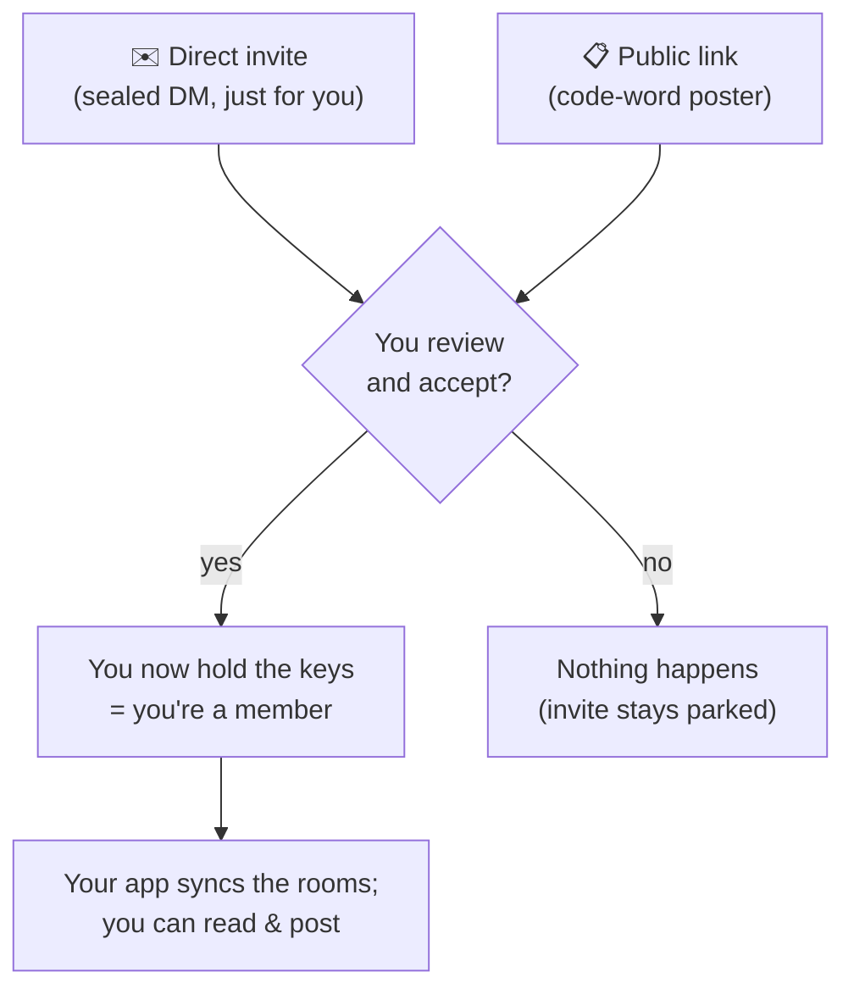

**Open vs members-only.** A club is **Open** (Concord calls this *Public*) while it keeps a code-word poster up — anyone with the link can let themselves in. It's **members-only** (*Private*) when there's no poster and the only way in is a hand-delivered invitation. A club can switch between the two — and switching *from* Open *to* members-only is, under the hood, a **relocation** (next section), because taking the poster down only matters if the people who already memorised the code-word can't keep using it.

Can someone forge an invite to hijack a club you're already in?

No. A club's identity is fixed and unforgeable. If an invitation claims to be for a club you already belong to but carries *different* keys, your app spots the mismatch and refuses it — an impostor can't hand you a fake key for a real club and quietly take it over.

### Public links: the secret lives in the link, not on the network

A public invite link looks ordinary — `https://vectorapp.io/invite#…` — but it pulls a neat trick: **the community's keys are never what gets posted publicly.** What actually sits on the relays is just a *locked box*. The only thing that can find it *and* open it is a secret **code-word baked into the link itself** — the jumble after the `#`.

That code-word (a random token) does three jobs, all derived from it alone:

- it points to *where* the box sits on the relays (a location only the code-word can compute),
- it holds the *key* that decrypts the box, and
- it proves the box is the *real* one — so a stranger can't slip a fake invitation into the same spot.

And the code-word stays remarkably off-network. It rides in the link's `#fragment` — which, by the way the web works, your browser **never sends to the web page's server** when the link is opened; it's read locally. It never reaches the relays either: they only ever hold the locked box, never the code-word that opens it.

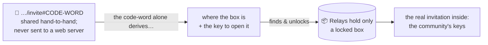

So **"public" means *anyone holding the link* can let themselves in — not *anyone on the network* can read it.** To everyone else — every relay, and even the web page that renders the invite — it's an opaque box with no way in. The owner can **rotate** a link (re-post a fresh box), **revoke** it (take the box down, leaving a small "revoked" sign so apps fail cleanly), and links can carry an **expiry** and a note of **who created them**.

It's the club's code-word poster made literal: the poster is out in the world, but the words printed on it are the only thing that opens the door.

---

## Getting out: kicks, bans, and changing halls

Removing someone from an end-to-end-encrypted space is the genuinely hard problem, because **you can't un-give a key.** Once someone holds the room key, no amount of wishing takes it back. Concord has two answers, for two situations.

**Soft removal — a kick, or hiding a message.** This is the *cooperative* kind from earlier: a moderator signs "drop this," and every honest app obeys. Fine for clearing spam or showing someone the door politely — but it leans on goodwill, and the person technically still holds the key.

**Hard removal — a ban from a members-only club.** When you need someone genuinely *gone*, unable to read anything new, the club does what a careful club does when a key is loose: **it moves.**

> The owner books a new hall a few miles away, quietly gives every *remaining* member the new address, and the club starts meeting there. The old hall still stands, its past conversations intact — but it's empty now, and the banned person is left sitting in it, holding a key to a room where nothing new will ever happen.

That new hall is a new **epoch**: a fresh key, handed only to the people who should still be there. In Concord's words, the club has *re-founded* itself at a new location.

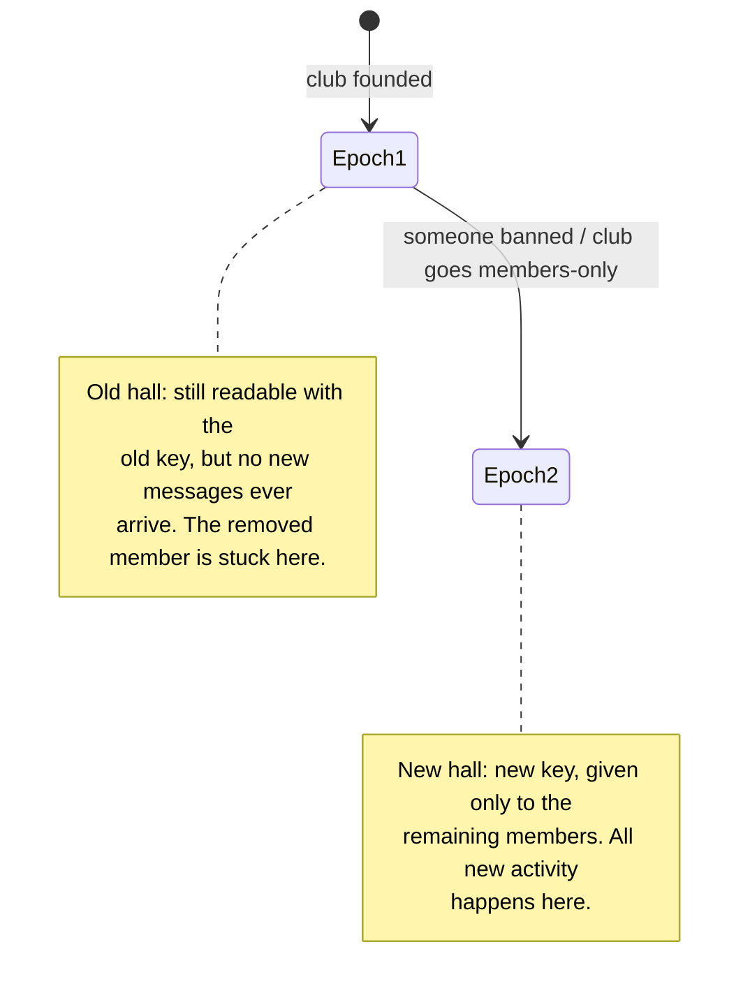

A few honest truths about this:

- **Banning stops the future, not the past.** The removed person keeps whatever they already had — the old hall and everything said while they were a member. You're locking the *next* chapter, not erasing the ones they already read. (That's inherent to end-to-end encryption: you can't reach into someone's memory.)
- **Going members-only is the same move.** Taking down the public code-word only truly cuts off the public if the club *also* relocates — otherwise anyone who memorised it could still wander in. So "switch to Private" quietly triggers the same hall-change.
- **Everyone lands at the same new hall.** Even if two organisers call for a move at the very same moment, the club has a tie-break rule so all members converge on one agreed location instead of splitting in two. *How* a club agrees on anything with no central server to referee is exactly the next section.

---

## Staying in sync

With no central server holding the one true copy, how does everybody — and all your own devices — end up agreeing on what a community looks like: who's an admin, what its name is, which hall it's meeting in?

The trick is that **everyone re-derives the same answer from the same signed receipts.** Every change to a community — a role granted, a name edited, a relocation — is a small, signed record posted to the relays. Your app gathers those records and **folds** them into a current picture. Because each record is signed, ordered, and governed by the same tie-break rules, **two members who've seen the same records compute the identical result.** No referee needed; the math referees itself.

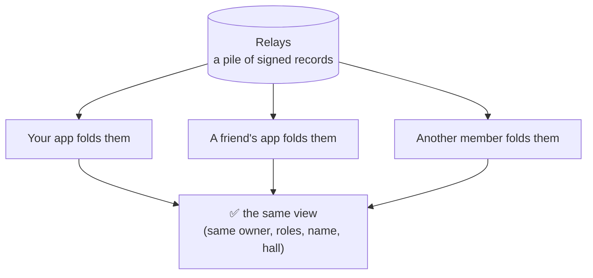

A few things make this hold up:

- **Many relays, gathered together.** You don't trust any single relay; you pull from several and take the union. A record missing from one is found on another, so no single relay can quietly hide a change or feed you a stale picture.
- **It ratchets forward, never backward.** As new records arrive, your view advances toward the latest *valid* state — and the rules refuse to roll backward, so a relay replaying old records can't make you "un-see" an admin change or a relocation. If something looks tampered or incomplete, your app waits for the real thing instead of accepting a wrong one.
- **That tie-break, concretely.** Remember the two-organisers-relocate-at-once case? When records genuinely conflict, every app applies the same deterministic rule to pick one winner — so the community heals to a single state instead of splitting in two.

The same machinery keeps **your own devices** in lockstep: your list of communities (and the keys to them) travels as an encrypted note addressed to *yourself*, so your phone and laptop arrive at the same place — and a fresh device picks up exactly where you left off.

---

## What's private, and what isn't

No honest privacy tool should hand-wave this. Here's the real boundary.

**Strongly hidden** — the contents and identities *inside* a community:

| What | Who can see it |
|---|---|
| Message content (text, files) | Only members holding the key |
| Who wrote what | Only members — the author proof is *inside* the encryption |
| Community & channel names, topics, icons | Only members |
| Member list, roles, bans | Only members |

Relays, network observers, and non-members see **none** of that — only scrambled blobs addressed to rotating, meaningless labels.

**Not hidden** — the *shape* of the traffic, not its contents:

| What | Reality |
|---|---|
| That *some* encrypted traffic exists on a relay | Visible — the blobs are public, just unreadable |
| Rough volume and timing of activity | Visible to a relay (how much, how often) |
| Your IP address, to the relays you use | Visible unless you route through Tor or a VPN |
| Noticing that a clump of blobs "belong together" | **Resisted** — messages in a room share a label that rotates over time, so an outsider can group *some* traffic within a window, but never learns which room it is or who's in it. Resistance, not a guarantee against a determined global observer |

In one line: Concord gives you **strong content and identity privacy, with solid metadata resistance and great everyday UX.** It hides *what* you say and *who* you are inside a community — what it doesn't claim to hide is *that you use encrypted communities at all.*

---

## Your device is a vault too

Wire encryption protects your messages out in the world — on the relays, in transit, from everyone without the key. But there's one more copy: the one on **your own device.**

Vector can lock that down too. With **Local Encryption** on, your device's local store — message history, the community keys, all the metadata — is encrypted with a key derived from your PIN. Lose your phone, or have a laptop seized? Without the PIN, it's noise.

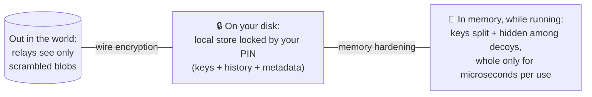

Three walls, not one. The first two are what you'd expect: the relays only ever see scrambled blobs, and your on-disk store — including the **community keys themselves** — is locked by your PIN, so a thief can't lift the keys off your disk and read the community from the relays either.

The third wall is the one most apps skip entirely. Even while Vector is **unlocked and running**, your keys don't just sit in memory waiting to be grabbed: each one is split into pieces and scattered among 128 look-alike decoy arrays, reassembled into a whole key only for the few microseconds it takes to sign or decrypt, then wiped. A memory scanner, an info-stealer, or a seized-and-imaged laptop finds noise — no 32 bytes to grep for. (Most messengers, Signal and Telegram included, leave the in-memory key sitting in the clear; see [`docs/security/memory-security.md`](../security/memory-security.md) for the full comparison and threat model.)

Two honest notes. This wall shuts out an entire category outright: passive memory readers, forensic dumps, swap-file scraping, and ordinary info-stealer malware — *even something already running on your machine as you*. The platform protections stop it from reading Vector's memory at all, and the vault would hand it only noise if it did. What it does **not** stop is a *targeted, privileged* attacker — someone who has escalated to **root or kernel control** (or slipped code in before launch) and can then actively hook the app during the microsecond a key is whole. That's a serious, deliberate compromise, not the commodity "scan memory for 32 bytes" malware this defeats completely. And the disk wall is only ever as strong as the PIN you choose. The cryptography is solid; pick a PIN worthy of it.

---

## Getting the most out of Concord

Here's the part most tools won't say plainly: **strong secrecy, over time, is a people problem — not a cryptographic one.**

Start with the good news: **new communities already ship with the safest defaults** — Private and invite-only. You don't have to harden anything; you begin hardened.

And the cryptography doesn't weaken as you grow. A community of 5 and a community of 5,000 get the **exact same full on-wire encryption** — the math is size-invariant.

What *does* grow with size is the **human surface**. Every member is a complete copy of the conversation — a person who can screenshot it, repeat it, have their device compromised, or simply not be who you hoped. That isn't a Concord limitation; it's true of *every* group-messaging system ever built, encrypted or not. The clubhouse walls are soundproof and the keys unforgeable — but a club is only ever as discreet as the people inside it.

So if real privacy is the point:

- **Keep sensitive communities small and invite-only.** Fewer people = fewer copies of the secret = fewer ways it walks out the door.
- **Invite people you'd trust with the conversation in person** — because cryptographically, that's exactly what you're doing.
- **Use a strong PIN**, so the vault on your own device is worth its locks.
- **Remember a ban locks the future, not the past** — choose your members like you mean it.

Concord gives you a clubhouse no company owns, no central server can read, and no outsider can crash. The rest — who you hand a key to — is, rightly, up to you.

---

## The whole thing, in a breath

A Concord community is three honest pieces: a **shared key** that *is* the membership, a **signed roster** anyone can verify, and a handful of **interchangeable relays** that only ever carry scrambled blobs. Messages are sealed once and read by every member; authority is math anyone can check, not a power a company grants; removing someone means the club quietly **moves to a new hall**; and your own devices keep in step through encrypted notes you address to yourself. No central server in the middle — nothing to subpoena, hack, or switch off.

That's Concord: Discord-shaped communities, end-to-end encrypted, that belong to the people in them.
